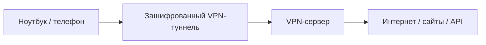
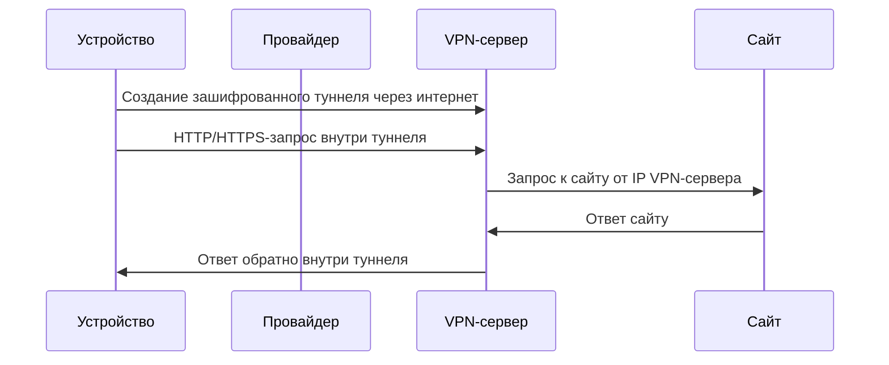

# Что такое VPN

**VPN** (*Virtual Private Network*, виртуальная частная сеть) — это способ создать защищённое логическое соединение поверх уже существующей сети, чаще всего поверх интернета.

Проще говоря: VPN создаёт **зашифрованный туннель** между твоим устройством и VPN-сервером. После этого часть или весь сетевой трафик идёт не напрямую к сайтам, а через этот сервер.



Без VPN путь обычно такой:

```text
Устройство → роутер → провайдер → сайт
```

С VPN:

```text
Устройство → роутер → провайдер → VPN-сервер → сайт
```

Ключевая идея: **сайт видит IP-адрес VPN-сервера, а не напрямую твой домашний или офисный IP**. Провайдер при этом видит, что ты подключился к VPN-серверу, но не должен видеть содержимое трафика внутри VPN-туннеля.

---

## Короткое определение

> [!summary]
> VPN — это сетевой туннель, который шифрует соединение между твоим устройством и VPN-сервером и перенаправляет трафик через этот сервер.

VPN решает две основные задачи:

1. **Шифрование участка соединения** между тобой и VPN-сервером.
2. **Изменение маршрута трафика**, чтобы внешний интернет видел VPN-сервер как точку выхода.

Важно: VPN не делает пользователя полностью анонимным. Он меняет сетевой маршрут и повышает приватность на определённом участке, но не отменяет cookies, аккаунты, fingerprinting и логи на стороне сервисов.

---

## Как работает VPN по шагам

Допустим, ты открываешь сайт `example.com` при включённом VPN.

1. VPN-клиент на ноутбуке устанавливает соединение с VPN-сервером.
2. Между устройством и VPN-сервером создаётся зашифрованный туннель.
3. Система меняет таблицу маршрутизации: весь трафик или часть трафика начинает идти через VPN-интерфейс.
4. Браузер отправляет запрос к сайту.
5. Запрос попадает в VPN-туннель.
6. VPN-сервер получает трафик, расшифровывает его и отправляет дальше в интернет.
7. Сайт отвечает VPN-серверу.
8. VPN-сервер возвращает ответ обратно через туннель на твоё устройство.



---

## Что именно видят разные участники

### Провайдер

Провайдер обычно видит:

- что ты подключился к конкретному VPN-серверу;
- IP-адрес VPN-сервера;
- объём передаваемых данных;
- время подключения;
- примерную длительность сессии.

Провайдер обычно не видит:

- содержимое трафика внутри VPN-туннеля;
- конкретные страницы, которые ты открываешь;
- содержимое HTTPS-запросов.

### Сайт

Сайт обычно видит:

- IP-адрес VPN-сервера;
- браузерные данные: User-Agent, язык, часовой пояс, размер экрана;
- cookies;
- аккаунт, если ты вошёл в систему;
- поведение на сайте.

Сайт обычно не видит:

- твой реальный внешний IP от провайдера;
- твою локальную сеть;
- твой локальный IP вроде `192.168.1.20`.

### VPN-провайдер

VPN-провайдер может видеть больше, чем обычный сайт:

- твой реальный IP;
- IP-адреса или домены, к которым ты обращаешься;
- время подключения;
- объём трафика;
- иногда DNS-запросы.

> [!warning]
> VPN переносит доверие. Без VPN ты больше доверяешь провайдеру интернета. С VPN ты начинаешь больше доверять VPN-провайдеру.

---

## VPN и HTTPS — это не одно и то же

[[HTTPS]] защищает соединение между браузером и конкретным сайтом.

VPN защищает соединение между твоим устройством и VPN-сервером.

```text
Браузер → HTTPS → сайт
```

```text
Устройство → VPN-туннель → VPN-сервер → сайт
```

Вместе они могут работать так:

```text
Браузер → HTTPS внутри VPN-туннеля → VPN-сервер → HTTPS → сайт
```

То есть VPN не заменяет HTTPS. Даже с VPN лучше всегда использовать сайты по HTTPS.

> [!danger]
> Если сайт работает без HTTPS, VPN защищает только участок до VPN-сервера. После выхода из VPN-сервера трафик к сайту может идти без защиты.

---

## VPN vs Proxy

[[Proxy]] тоже является посредником, но работает иначе.

| Критерий | VPN | Proxy |
|---|---|---|
| Уровень работы | Обычно вся система или сетевой интерфейс | Часто конкретное приложение |
| Шифрование | Обычно есть | Не обязательно |
| Меняет IP | Да | Да |
| Подходит для всего трафика | Обычно да | Зависит от типа proxy |
| Типичный пример | WireGuard, OpenVPN, IKEv2/IPsec | HTTP proxy, SOCKS5 proxy |
| Частый сценарий | Безопасный туннель, корпоративный доступ | Проксирование браузера, парсинг, обход ограничений |

Главное различие:

- **VPN** создаёт сетевой туннель.
- **Proxy** пересылает запросы как посредник.

Если настроить proxy только в браузере, то браузер будет ходить через proxy, а другие приложения могут идти напрямую. Если включить VPN на уровне системы, то обычно весь трафик устройства идёт через VPN, если не настроен split tunneling.

---

## Основные виды VPN

### 1. Consumer VPN

Это обычные VPN-сервисы для личного использования.

Примеры задач:

- скрыть реальный IP от сайтов;
- повысить приватность в публичном Wi-Fi;
- изменить регион выхода в интернет;
- обойти сетевые ограничения.

### 2. Corporate VPN

Корпоративный VPN нужен не столько для «смены страны», сколько для доступа к внутренней сети компании.

```text
Ноутбук сотрудника → VPN → внутренняя сеть компании → staging / база данных / админка
```

Через такой VPN могут быть доступны:

- внутренние сайты;
- базы данных;
- staging-сервера;
- приватные API;
- внутренние панели администрирования;
- dev-инфраструктура.

### 3. Site-to-site VPN

Такой VPN соединяет не одного пользователя с сетью, а две сети между собой.

```text
Офис A → VPN-туннель → Офис B
```

Или:

```text
Cloud VPC → VPN-туннель → офисная сеть
```

Это часто используется в компаниях, когда нужно связать офис, датацентр и облачную инфраструктуру.

### 4. Self-hosted VPN

Это VPN, который ты поднимаешь сам на своём сервере.

Например:

- WireGuard на VPS;
- OpenVPN на домашнем сервере;
- Tailscale / Headscale-подобная mesh-сеть;
- ZeroTier-подобная виртуальная сеть.

Плюс: больше контроля.

Минус: нужно самому отвечать за безопасность, обновления и конфигурацию.

---

## Популярные VPN-протоколы

### WireGuard

[[WireGuard]] — современный VPN-протокол, который ценят за простоту, скорость и небольшую кодовую базу. Часто используется в современных VPN-сервисах и self-hosted конфигурациях.

Типичные плюсы:

- высокая скорость;
- простая конфигурация;
- хорошая работа на мобильных устройствах;
- современная криптография.

Типичные нюансы:

- меньше встроенной гибкости, чем у OpenVPN;
- нужно аккуратно проектировать управление ключами и доступами.

### OpenVPN

[[OpenVPN]] — старый, гибкий и широко распространённый протокол.

Типичные плюсы:

- зрелая экосистема;
- много документации;
- гибкая настройка;
- часто используется в корпоративной среде.

Типичные нюансы:

- может быть медленнее WireGuard;
- конфигурация сложнее;
- больше moving parts.

### IKEv2/IPsec

[[IPsec]] и IKEv2 часто встречаются в корпоративных и мобильных сценариях.

Типичные плюсы:

- хорошая поддержка в ОС;
- стабильная работа при переключении сетей;
- подходит для enterprise-инфраструктуры.

Типичные нюансы:

- конфигурация может быть сложной;
- диагностика ошибок иногда неприятная.

---

## Split tunneling

**Split tunneling** — это режим, когда через VPN идёт только часть трафика.

Например:

```text
Корпоративные сервисы → через VPN
YouTube / Spotify / обычный интернет → напрямую
```

Плюсы:

- меньше нагрузка на VPN;
- быстрее работает обычный интернет;
- меньше проблем с сервисами, которые блокируют VPN.

Минусы:

- выше риск утечек;
- сложнее понять, какой трафик куда идёт;
- нужно аккуратно настраивать маршруты и DNS.

---

## DNS и VPN

[[DNS]] превращает домены в IP-адреса.

```text
google.com → 142.250.x.x
```

С VPN важно понимать, куда уходят DNS-запросы.

В идеале при включённом VPN DNS-запросы тоже должны идти через VPN или через DNS-сервер, заданный VPN-клиентом.

Проблема возникает, когда основной трафик идёт через VPN, а DNS-запросы продолжают уходить провайдеру.

Это называется **DNS leak**.

```text
Сайт открывается через VPN,
но запрос "какой IP у example.com?" уходит провайдеру.
```

> [!warning]
> DNS leak не обязательно раскрывает содержимое страниц, но может показать, к каким доменам ты обращаешься.

---

## Kill switch

**Kill switch** — функция VPN-клиента, которая блокирует интернет, если VPN неожиданно отключился.

Без kill switch:

```text
VPN отключился → трафик пошёл напрямую через провайдера
```

С kill switch:

```text
VPN отключился → интернет заблокирован до восстановления VPN
```

Это полезно, если важно, чтобы трафик случайно не ушёл мимо VPN.

---

## Что VPN скрывает, а что нет

| Что | VPN помогает скрыть? | Комментарий |
|---|---:|---|
| Реальный IP от сайта | Да | Сайт видит IP VPN-сервера |
| Содержимое трафика от провайдера | Да, если туннель настроен корректно | Особенно важно в публичных сетях |
| Факт использования VPN | Нет | Провайдер может видеть соединение с VPN-сервером |
| Аккаунт на сайте | Нет | Если ты вошёл в Google/GitHub/Instagram, сайт знает аккаунт |
| Cookies | Нет | Cookies остаются в браузере |
| Browser fingerprinting | Нет | Сайт может узнавать браузер по параметрам окружения |
| Вредоносные сайты | Не напрямую | VPN не заменяет антивирус и здравый смысл |
| Ошибки в приложении | Нет | Уязвимости backend/frontend VPN не исправляет |

---

## Частые мифы о VPN

### Миф 1: «VPN делает меня полностью анонимным»

Нет. VPN меняет IP и шифрует участок соединения до VPN-сервера, но не скрывает всё.

Тебя всё ещё могут идентифицировать через:

- аккаунты;
- cookies;
- fingerprinting;
- поведение;
- платежные данные;
- email;
- номер телефона;
- ошибки конфигурации.

### Миф 2: «Если есть VPN, HTTPS не нужен»

Неверно. HTTPS всё равно нужен, потому что он защищает соединение между браузером и сайтом.

### Миф 3: «Бесплатный VPN всегда безопасен»

Не обязательно. Бесплатный VPN может монетизироваться через рекламу, ограничения, сбор данных или продажу дополнительных услуг. Нужно понимать бизнес-модель сервиса.

### Миф 4: «VPN ускоряет интернет»

Обычно VPN добавляет дополнительный маршрут и шифрование, поэтому может замедлять соединение. Иногда он субъективно ускоряет доступ к конкретному ресурсу, если маршрут через VPN удачнее, но это не гарантируется.

---

## Что важно full-stack разработчику

Full-stack разработчику не обязательно быть сетевым инженером, но нужно понимать, как VPN влияет на разработку, деплой и диагностику.

### 1. Корпоративный VPN может менять DNS

После подключения к VPN могут начать резолвиться внутренние домены:

```text
api.staging.internal
postgres.internal
admin.company.local
```

Без VPN такие адреса могут не открываться вообще.

### 2. VPN может менять маршруты

После подключения часть сетей может стать доступна через приватные IP:

```text
10.0.0.0/8
172.16.0.0/12
192.168.0.0/16
```

Например, база данных может быть доступна только из VPN-сети.

### 3. VPN может ломать локальную разработку

Иногда после включения VPN перестают работать:

- локальные dev-сервера;
- Docker-сети;
- доступ к устройствам в домашней сети;
- DNS для локальных доменов;
- WebSocket-соединения;
- соединения с внешними API.

Причина часто не в коде, а в маршрутизации, DNS или firewall-правилах.

### 4. Нельзя слепо доверять IP пользователя

Если пользователь сидит за VPN, proxy, NAT или корпоративной сетью, его IP может быть общим для многих людей.

Это важно для:

- rate limiting;
- антифрода;
- логов;
- аудита;
- геолокации;
- блокировок.

### 5. Reverse proxy и VPN — разные вещи

[[Reverse proxy]] стоит со стороны сервера:

```text
Пользователь → Cloudflare / Nginx / Load Balancer → Backend
```

VPN обычно стоит со стороны клиента или между сетями:

```text
Разработчик → VPN → внутренняя сеть компании
```

Они могут использоваться одновременно, но решают разные задачи.

---

## Связанные темы, которые стоит изучить

- [[Proxy]] — посредник между клиентом и сервером.
- [[Reverse proxy]] — прокси со стороны сервера: Nginx, Caddy, Cloudflare, AWS ALB.
- [[DNS]] — как домены превращаются в IP-адреса.
- [[HTTPS]] — защищённый HTTP поверх TLS.
- [[TLS]] — криптографический протокол для защищённых соединений.
- [[IP address]] — локальные и публичные IP-адреса.
- [[NAT]] — почему несколько устройств дома выходят в интернет через один внешний IP.
- [[Firewall]] — правила, которые разрешают или блокируют сетевой трафик.
- [[Ports]] — как приложения различаются внутри одного IP-адреса.
- [[Docker networking]] — почему `localhost` внутри контейнера не всегда означает твой ноутбук.
- [[CORS]] — почему браузер блокирует запросы между разными origin.
- [[WebSocket]] — постоянное соединение, которое может вести себя иначе через proxy/VPN.

---

## Практические упражнения

- [ ] Посмотреть свой публичный IP без VPN.
- [ ] Включить VPN и снова посмотреть публичный IP.
- [ ] Проверить, изменился ли DNS-сервер.
- [ ] Проверить DNS leak через специальный тест.
- [ ] Открыть DevTools → Network и посмотреть, что меняется в запросах.
- [ ] Проверить, какие сайты блокируют известные VPN-адреса.
- [ ] Подключиться к корпоративному VPN и проверить внутренний домен.
- [ ] Сравнить `curl ifconfig.me` до и после VPN.
- [ ] Проверить маршруты командой `netstat -rn` или `ip route`.
- [ ] Разобраться, включён ли split tunneling.

---

## Мини-глоссарий

**VPN-туннель** — зашифрованное соединение между устройством и VPN-сервером.

**VPN-клиент** — программа на устройстве, которая устанавливает VPN-соединение.

**VPN-сервер** — сервер, через который проходит трафик после подключения.

**Exit node / точка выхода** — сервер, с IP которого твой трафик выходит в интернет.

**DNS leak** — ситуация, когда DNS-запросы уходят не через VPN, а напрямую, например провайдеру.

**Split tunneling** — режим, в котором только часть трафика идёт через VPN.

**Kill switch** — защита, которая блокирует интернет при обрыве VPN.

**TUN/TAP** — виртуальные сетевые интерфейсы, через которые VPN может передавать IP-пакеты или Ethernet-фреймы.

**WireGuard** — современный VPN-протокол.

**OpenVPN** — зрелый и гибкий VPN-протокол.

**IPsec** — набор протоколов для защищённого обмена IP-трафиком.

---

## Главное резюме

VPN — это не «кнопка анонимности», а **сетевой инструмент**.

Он:

- создаёт зашифрованный туннель;
- меняет маршрут трафика;
- может скрывать реальный IP от сайтов;
- может давать доступ к внутренней сети компании;
- может защищать трафик в недоверенной сети;
- но не скрывает аккаунты, cookies, fingerprinting и поведение пользователя.

Для full-stack разработчика VPN важен как часть реальной инфраструктуры: он влияет на DNS, маршруты, доступ к staging/prod-сервисам, логи, IP-адреса пользователей и debugging сетевых проблем.

---

## Источники и дальнейшее чтение

- [NIST CSRC — Virtual Private Network](https://csrc.nist.gov/glossary/term/virtual_private_network)
- [Cloudflare — What is a VPN?](https://www.cloudflare.com/learning/access-management/what-is-a-vpn/)
- [MDN — Transport Layer Security](https://developer.mozilla.org/en-US/docs/Web/Security/Defenses/Transport_Layer_Security)
- [WireGuard — official website](https://www.wireguard.com/)
- [Quartz — Obsidian Compatibility](https://quartz.jzhao.xyz/features/obsidian-compatibility)
- [Quartz — Frontmatter](https://quartz.jzhao.xyz/plugins/frontmatter)
