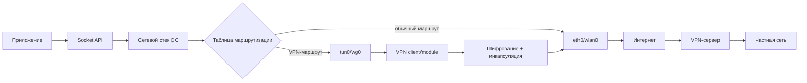
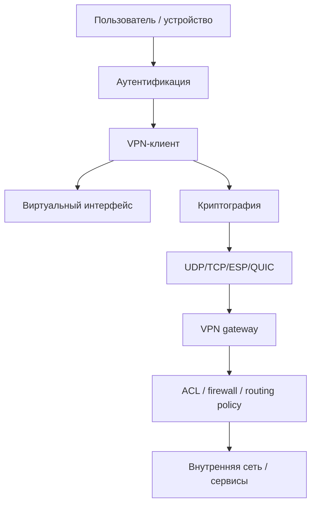
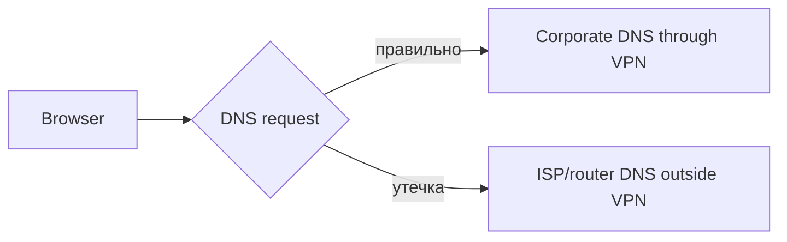
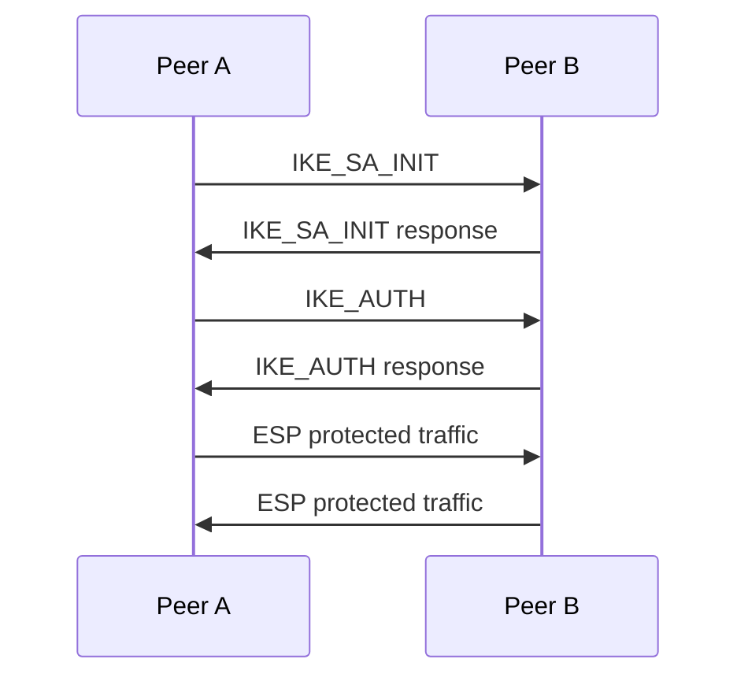
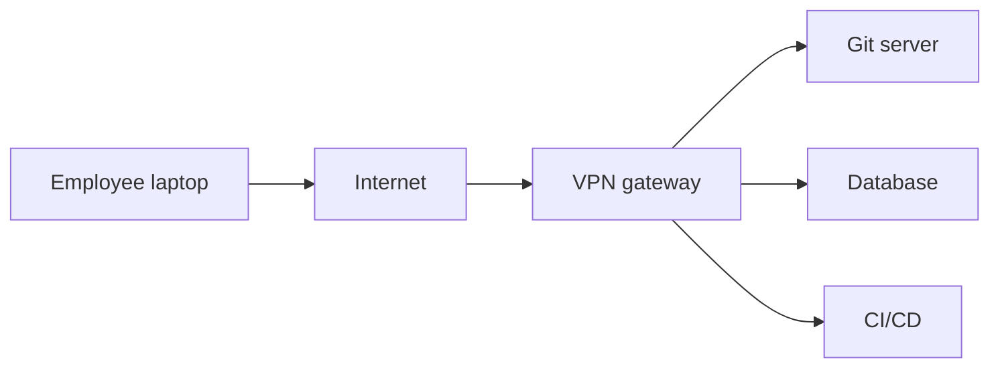
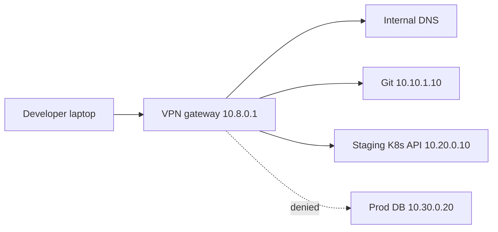
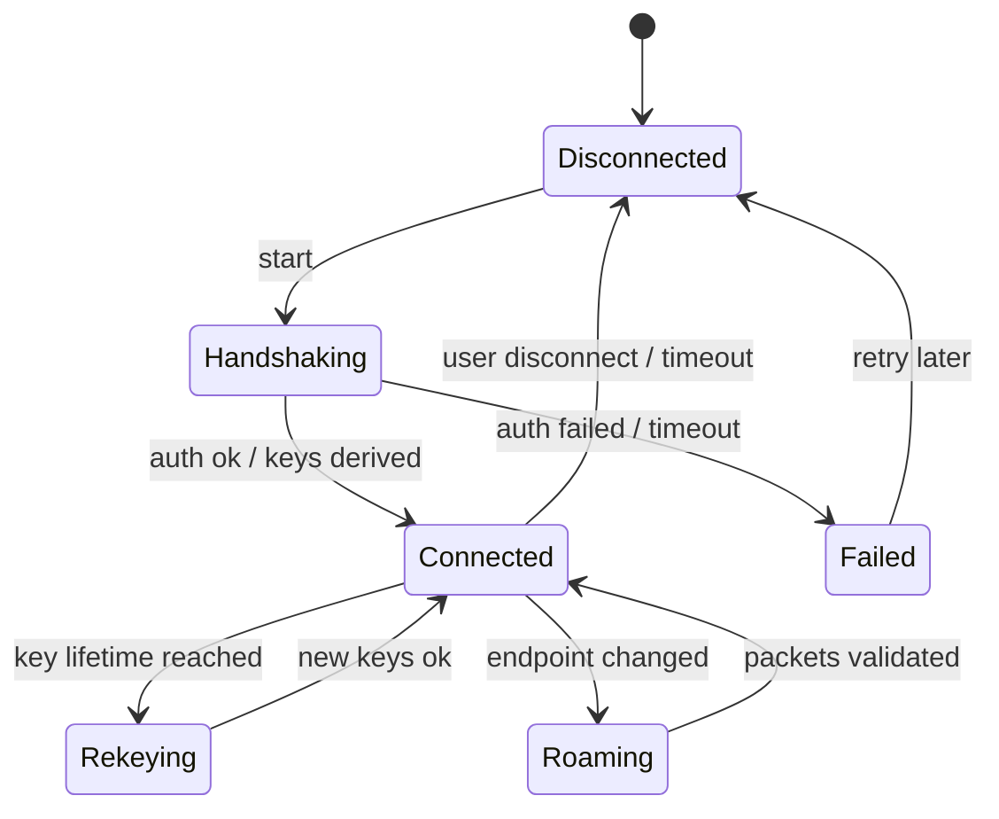
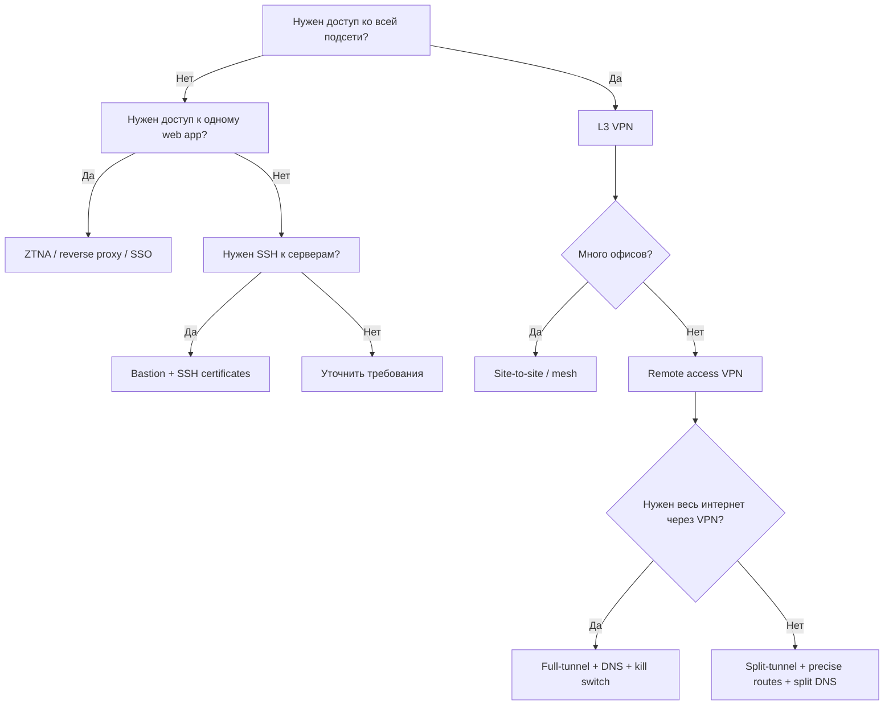

# VPN: от сетевой идеи до практической архитектуры

> [!abstract]
> **Цель материала** — объяснить VPN не как «кнопку для смены IP», а как инженерную сетевую систему: виртуальный интерфейс, туннель, маршрутизация, криптографическая защита, контроль доступа, DNS, NAT traversal, MTU и эксплуатация.
>
> Материал рассчитан на людей из сферы **Computer Science**: студентов, backend-разработчиков, DevOps/SRE, специалистов по безопасности и всех, кто уже понимает основы сетей, но хочет увидеть целостную картину.

---

## Как читать этот материал

Материал построен постепенно: сначала интуитивная модель, затем сетевые механизмы, криптография, протоколы, архитектуры и практическая диагностика.

Полезные разделы для быстрого перехода:

- [[#8 Жизненный цикл пакета внутри VPN|жизненный цикл пакета]];
- [[#14 Криптография VPN|криптография VPN]];
- [[#9 Маршрутизация full-tunnel split-tunnel и site-to-site|режимы маршрутизации]];
- [[#13 MTU MSS и фрагментация|MTU/MSS]];
- [[#32 Практическая диагностика|диагностика]].

---

## 1. Что такое VPN

**VPN** расшифровывается как **Virtual Private Network** — виртуальная частная сеть.

С инженерной точки зрения VPN — это механизм, который позволяет создать **логически приватный сетевой канал поверх другой, обычно недоверенной, сети**.

```text
Ваш ноутбук ── интернет ── VPN-сервер ── внутренняя сеть компании
```

Для приложений может казаться, что устройство находится внутри корпоративной сети, хотя физически пользователь подключен из дома, кафе, аэропорта или мобильной сети.

> [!important]
> VPN не «делает интернет магически безопасным». Он переносит границу доверия: вместо провайдера, Wi‑Fi-точки или локальной сети вы начинаете сильнее доверять VPN-серверу и инфраструктуре за ним.

---

## 2. Главная идея: туннель

В основе VPN лежит **туннелирование**. Обычный IP-пакет помещается внутрь другого пакета. Внешний пакет доставляется через публичную сеть, а внутренний сохраняет адресацию частной сети.

```text
Внутренний пакет:
┌─────────────────────────────────────────┐
│ Src: 10.8.0.2  Dst: 10.0.1.15           │
│ Payload: HTTP / SSH / DNS / ...         │
└─────────────────────────────────────────┘

После инкапсуляции:
┌────────────────────────────────────────────────────────────┐
│ Внешний IP: Src: 203.0.113.10  Dst: 198.51.100.20           │
│ UDP/TCP/ESP: VPN transport                                  │
│ ┌────────────────────────────────────────────────────────┐ │
│ │ Зашифрованный внутренний пакет                         │ │
│ │ Src: 10.8.0.2  Dst: 10.0.1.15                          │ │
│ └────────────────────────────────────────────────────────┘ │
└────────────────────────────────────────────────────────────┘
```

VPN обычно решает три задачи:

1. **Конфиденциальность** — содержимое трафика нельзя прочитать посреднику.
2. **Целостность** — пакет нельзя незаметно изменить.
3. **Аутентификация** — стороны убеждаются, что говорят с правильным peer/server.

---

## 3. Минимальная ментальная модель

VPN-клиент обычно создает или использует дополнительный виртуальный сетевой интерфейс:

```text
eth0 / wlan0  → настоящая сетевая карта
tun0 / wg0    → виртуальная VPN-карта
```

Когда ОС решает отправить пакет через `tun0` или `wg0`, пакет попадает не в физический Ethernet/Wi‑Fi напрямую, а в VPN-программу или VPN-модуль ядра. Там пакет шифруется, инкапсулируется и отправляется через реальный интерфейс.



> [!note]
> Для большинства приложений VPN прозрачен. Браузер, SSH-клиент или пакетный менеджер обычно не знают, что пакет ушел через VPN. Они просто используют сетевой стек ОС.

---

## 4. Почему VPN называется «виртуальной частной сетью»

### Virtual

Сеть не существует как отдельная физическая инфраструктура. Она строится поверх уже существующей сети: интернета, корпоративной WAN, облачной сети или мобильного подключения.

### Private

Трафик внутри туннеля защищен криптографически и логически отделен от внешней сети.

### Network

VPN — это именно сеть, а не только шифрование. Здесь есть адреса, маршруты, интерфейсы, DNS, политики доступа, таблицы состояний, проблемы MTU, NAT, диагностика и эксплуатация.

---

## 5. Где VPN находится в модели OSI/TCP-IP

VPN можно строить на разных уровнях.

| Уровень | Пример | Что туннелируется | Типичные сценарии |
|---|---|---|---|
| L2 | L2TP, TAP-режим OpenVPN | Ethernet-кадры | legacy-сети, broadcast/multicast, «как будто один LAN» |
| L3 | WireGuard, IPsec tunnel mode, TUN-режим OpenVPN | IP-пакеты | remote access, site-to-site, облака |
| L4 | TLS/QUIC-туннели | TCP/UDP-потоки или проксируемые соединения | обход сложных сетей, application-aware access |
| L7 | reverse proxy, ZTNA, application gateway | HTTP/gRPC/SSH на уровне приложений | доступ к конкретным сервисам вместо всей сети |

Большинство современных VPN для общего доступа работают на **L3**, потому что IP-пакеты проще маршрутизировать, контролировать и масштабировать.

---

## 6. TUN и TAP

| Тип | Уровень | Что передает | Когда полезен |
|---|---:|---|---|
| `TUN` | L3 | IP-пакеты | routing, remote access, site-to-site |
| `TAP` | L2 | Ethernet-кадры | broadcast, non-IP traffic, bridge |

`TUN`-интерфейс работает как виртуальный IP-интерфейс:

```text
Приложение → IP packet → tun0 → VPN → encrypted packet → internet
```

`TAP`-интерфейс работает как виртуальная Ethernet-карта:

```text
Приложение → Ethernet frame → tap0 → VPN → encrypted frame → internet
```

> [!tip]
> Если нет явной причины использовать L2, обычно лучше выбирать L3/TUN-подход. Он проще, безопаснее в эксплуатации и лучше масштабируется.

---

## 7. Основные компоненты VPN



### Клиент

Клиент создает или использует виртуальный интерфейс, получает адрес в VPN-сети, устанавливает криптографическую сессию, меняет маршруты и DNS, отправляет keepalive-пакеты и обрабатывает reconnect при смене сети.

### VPN-gateway

Gateway принимает подключения, проверяет ключи, сертификаты или учетные данные, расшифровывает трафик, маршрутизирует пакеты дальше, применяет firewall/ACL и ведет логи событий.

### Control plane и data plane

| Plane | Назначение | Примеры |
|---|---|---|
| Control plane | Договориться о параметрах | handshake, обмен ключами, аутентификация, выдача IP |
| Data plane | Передавать пользовательский трафик | зашифрованные IP-пакеты, replay protection, counters |

---

## 8. Жизненный цикл пакета внутри VPN

Рассмотрим запрос к внутреннему сервису:

```bash
curl http://10.0.1.15:8080
```

1. Приложение создает socket.
2. Сетевой стек ОС строит IP-пакет.
3. ОС смотрит таблицу маршрутизации.
4. Пакет попадает в VPN-интерфейс.
5. VPN-клиент шифрует и инкапсулирует пакет.
6. Внешний пакет идет через интернет.
7. VPN-gateway проверяет и расшифровывает пакет.
8. Внутренний пакет маршрутизируется к сервису.
9. Ответ идет обратно тем же логическим путем.

Пример маршрутов:

```bash
10.0.0.0/8 dev wg0
default via 192.168.1.1 dev wlan0
```

Пакет к `10.0.1.15` уйдет в `wg0`.

```text
inner: 10.8.0.2       → 10.0.1.15
outer: 192.168.1.25   → 198.51.100.20
```

Маршрутизаторы интернета видят только внешний пакет. Они не знают внутренние адреса и не могут прочитать зашифрованное содержимое.

---

## 9. Маршрутизация: full-tunnel, split-tunnel и site-to-site

Маршрутизация определяет, какой трафик уйдет в VPN.

### Full-tunnel

Весь трафик клиента идет через VPN:

```text
0.0.0.0/0 → VPN
::/0      → VPN
```

Плюсы: проще контролировать исходящий трафик, меньше риск DNS leak, удобно для корпоративных политик и недоверенных сетей.

Минусы: больше нагрузка на gateway, выше задержка до обычных интернет-ресурсов, возможны проблемы с CDN/географией, gateway становится критической точкой отказа.

### Split-tunnel

Через VPN идет только часть трафика:

```text
10.0.0.0/8     → VPN
172.16.0.0/12  → VPN
0.0.0.0/0      → обычный интернет
```

Плюсы: ниже нагрузка, обычный интернет работает напрямую, меньше latency для внешних сервисов.

Минусы: сложнее контролировать, выше риск DNS leak, локальная сеть пользователя может оставаться доступной, threat model сложнее.

### Site-to-site

VPN соединяет две сети:

```text
Office A: 10.1.0.0/16 ── VPN ── Office B: 10.2.0.0/16
```

Используется для связи офисов, on-premise и cloud, Kubernetes/VM-сетей, миграций между дата-центрами и резервных каналов.

### Road warrior

Так называют сценарий, где отдельный пользователь подключается к корпоративной сети из произвольного места:

```text
Laptop ── VPN ── Corporate network
```

---

## 10. Таблица маршрутизации и AllowedIPs

В некоторых VPN, например WireGuard, параметр `AllowedIPs` одновременно описывает:

1. какие адреса разрешены для peer;
2. какие маршруты направлять через этот peer.

```ini
[Peer]
PublicKey = SERVER_PUBLIC_KEY
AllowedIPs = 10.0.0.0/8
Endpoint = vpn.example.com:51820
```

Для full-tunnel:

```ini
AllowedIPs = 0.0.0.0/0, ::/0
```

> [!warning]
> Важно понимать семантику конкретного протокола. В одном VPN «allowed IPs» может быть ACL, в другом — routing selector, а в третьем — и то, и другое.

---

## 11. DNS внутри VPN

DNS часто становится слабым местом VPN-дизайна. В корпоративной сети могут быть внутренние имена:

```text
git.internal.example.com
db.prod.internal
vault.service.consul
```

Обычный публичный DNS их не знает. Поэтому VPN-клиент может назначить корпоративный DNS-сервер.

### DNS leak

**DNS leak** — ситуация, когда трафик идет через VPN, но DNS-запросы уходят наружу, например к DNS провайдера или локального роутера.



Это плохо, потому что внешний наблюдатель видит домены, внутренние имена могут раскрыть структуру организации, а split-horizon DNS может сломаться.

### Split DNS

**Split DNS** означает, что разные домены резолвятся через разные DNS-серверы:

```text
*.corp.example.com → DNS через VPN
остальное          → обычный DNS
```

> [!tip]
> При проектировании VPN всегда отдельно проектируйте DNS. Не считайте DNS «деталью»: на практике именно он часто ломает доступ к сервисам.


---

## 12. NAT и NAT traversal

Большинство клиентов находятся за NAT:

```text
Laptop: 192.168.1.25
Router public IP: 203.0.113.10
VPN server: 198.51.100.20
```

Снаружи сервер видит не `192.168.1.25`, а публичный адрес роутера.

### Почему NAT мешает VPN

Проблемы возникают, когда:

- соединение должно быть входящим к клиенту;
- NAT удаляет state из таблицы;
- меняется сеть, например Wi‑Fi → LTE;
- несколько клиентов за одним NAT используют одинаковые параметры;
- провайдер использует CGNAT;
- firewall блокирует UDP.

### Keepalive

Чтобы NAT не забывал UDP-сессию, VPN может отправлять keepalive:

```text
client ── tiny packet every N seconds ── server
```

Это не передает полезные данные, но сохраняет NAT binding.

### UDP против TCP

Многие VPN используют UDP, потому что у него меньше overhead, проще избежать «TCP-over-TCP meltdown», легче управлять roaming и повторной передачей на нужном уровне.

VPN поверх TCP тоже существует, но при потерях пакетов внешний TCP и внутренний TCP могут независимо бороться за надежность, что ухудшает производительность.

> [!note]
> TCP-over-TCP — не абсолютный запрет, но для общего VPN-трафика UDP обычно предпочтительнее.

---

## 13. MTU, MSS и фрагментация

VPN добавляет заголовки. Значит, полезная нагрузка одного пакета уменьшается.

```text
Outer packet MTU = 1500
VPN overhead     = 60
Inner packet max ≈ 1440
```

Симптомы неправильного MTU:

- сайты частично открываются;
- SSH подключается, но «подвисает»;
- маленькие pings работают, большие — нет;
- TLS handshake ломается;
- некоторые API работают нестабильно;
- проблема проявляется только в отдельных сетях.

### MSS clamping

Для TCP можно ограничивать MSS, чтобы TCP-сегменты были меньше и помещались в туннель.

```text
MSS ≈ MTU - IP header - TCP header
```

Для IPv4 без опций:

```text
MSS ≈ MTU - 20 - 20
```

Если MTU VPN-интерфейса `1420`, то MSS примерно:

```text
1420 - 20 - 20 = 1380
```

> [!warning]
> MTU-проблемы часто выглядят как «рандомная нестабильность». При диагностике VPN всегда проверяйте MTU и Path MTU Discovery.

---

## 14. Криптография VPN

VPN использует криптографию для защиты трафика, но разные протоколы делают это по-разному.

Обычно нужны:

- обмен ключами;
- аутентификация сторон;
- симметричное шифрование;
- проверка целостности;
- защита от replay-атак;
- периодическая ротация ключей.

---

## 15. Симметричное шифрование и AEAD

После handshake стороны обычно получают общий секрет или набор session keys. Дальше данные шифруются симметричным алгоритмом.

Почему не шифровать всё асимметрично?

- асимметричная криптография медленнее;
- она удобна для обмена ключами и подписи;
- bulk traffic эффективнее шифровать симметрично.

Современные VPN часто используют AEAD-режимы.

**AEAD** означает **Authenticated Encryption with Associated Data**. AEAD одновременно обеспечивает конфиденциальность, целостность и аутентификацию ciphertext и дополнительных данных.

Примеры AEAD-конструкций:

- AES-GCM;
- ChaCha20-Poly1305.

> [!important]
> «Зашифровано» не всегда означает «защищено от подмены». Нужна проверка целостности и корректное использование nonce/sequence number.

---

## 16. Обмен ключами и Perfect Forward Secrecy

Handshake нужен, чтобы стороны договорились о ключах.

Современные протоколы обычно используют варианты Diffie–Hellman или elliptic-curve Diffie–Hellman:

1. стороны обмениваются публичными параметрами;
2. каждая сторона использует свой приватный секрет;
3. обе стороны получают общий session key;
4. наблюдатель не может вычислить этот ключ из публичного обмена.

### Perfect Forward Secrecy

**Perfect Forward Secrecy** означает: если долгосрочный ключ сервера будет скомпрометирован в будущем, прошлые сессии не должны автоматически раскрыться.

Это достигается использованием эфемерных session keys.

> [!note]
> На практике PFS зависит не только от алгоритма, но и от корректной реализации, ротации ключей, хранения секретов и конфигурации.

---

## 17. Аутентификация

VPN должен понимать, кто подключается.

| Метод | Пример | Плюсы | Минусы |
|---|---|---|---|
| PSK | общий pre-shared key | просто | плохо масштабируется, сложно отозвать одного пользователя |
| Сертификаты | X.509, CA | хорошо для организаций | нужна PKI и lifecycle |
| Публичные ключи | WireGuard-style peer keys | просто и надежно | нужна дисциплина управления ключами |
| Логин/пароль | LDAP, RADIUS, SSO | привычно | нужен MFA, риск фишинга |
| MFA | TOTP, push, hardware key | повышает защиту | UX и интеграция сложнее |
| Device posture | проверка устройства | полезно в enterprise | сложная инфраструктура |

### Отзыв доступа

В VPN важно не только выдать доступ, но и уметь быстро его отозвать:

- удалить public key;
- отозвать сертификат;
- отключить учетную запись;
- завершить активные сессии;
- удалить маршруты;
- обновить ACL;
- пересобрать конфиги.

---

## 18. Replay protection

Если атакующий записал зашифрованный пакет, он не должен иметь возможность отправить его повторно и получить эффект.

Для этого используются sequence numbers, sliding window, nonces, session keys, timestamps или counters — в зависимости от протокола.

```text
Packet #100 accepted
Packet #101 accepted
Packet #100 again → rejected as replay
```

---

## 19. Основные VPN-протоколы

Ниже — обзор протоколов на уровне инженерных свойств. Это не рейтинг «лучший/худший», потому что выбор зависит от требований.

| Протокол | Уровень | Transport | Сильные стороны | Ограничения |
|---|---:|---|---|---|
| WireGuard | L3 | UDP | простая модель, малый код, высокая производительность, roaming | меньше встроенных enterprise-функций, нужны внешние системы управления |
| IPsec/IKEv2 | L3 | ESP/UDP | стандарт де-факто для site-to-site, enterprise, network appliances | сложная конфигурация, много режимов и совместимости |
| OpenVPN | L2/L3 | UDP/TCP + TLS | зрелый, гибкий, хорошо проходит через разные сети | обычно больше overhead, user-space модель |
| L2TP/IPsec | L2 over IPsec | UDP | legacy-совместимость | часто не лучший выбор для новых систем |
| PPTP | L2 | TCP GRE | исторический | устаревший и небезопасный для новых deployments |
| TLS-based app tunnels | L4/L7 | TCP/QUIC | удобно для доступа к приложениям | это уже не всегда «полная сеть» |

> [!danger]
> PPTP не следует использовать для современных систем безопасности. Он важен только как исторический пример.

---

## 20. WireGuard как современная L3-модель

WireGuard полезен для понимания современной VPN-архитектуры, потому что у него минималистичная модель:

- каждый peer имеет public/private key;
- peer описывает `AllowedIPs`;
- используется UDP;
- поддерживается roaming;
- конфигурация похожа на таблицу соответствий: ключ → разрешенные IP;
- обычно работает на L3.

Пример учебной конфигурации клиента:

```ini
[Interface]
PrivateKey = CLIENT_PRIVATE_KEY
Address = 10.8.0.2/32
DNS = 10.8.0.1

[Peer]
PublicKey = SERVER_PUBLIC_KEY
Endpoint = vpn.example.com:51820
AllowedIPs = 10.0.0.0/8
PersistentKeepalive = 25
```

Сервер:

```ini
[Interface]
PrivateKey = SERVER_PRIVATE_KEY
Address = 10.8.0.1/24
ListenPort = 51820

[Peer]
PublicKey = CLIENT_PUBLIC_KEY
AllowedIPs = 10.8.0.2/32
```

> [!warning]
> Это учебный пример. В реальной инфраструктуре нужны firewall-правила, управление ключами, мониторинг, резервное копирование и понятная процедура отзыва доступа.

---

## 21. IPsec и IKEv2

**IPsec** — набор протоколов для защиты IP-трафика. Он часто используется для site-to-site VPN и enterprise-сценариев.

Важные элементы:

- **ESP** — Encapsulating Security Payload, защита данных;
- **AH** — Authentication Header, сейчас используется реже;
- **IKEv2** — протокол согласования параметров и ключей;
- **SA** — Security Association, набор параметров безопасности;
- **tunnel mode** — инкапсулирует весь IP-пакет;
- **transport mode** — защищает payload IP-пакета.



IPsec мощный, но сложный: много алгоритмов, режимов, совместимости, NAT traversal, vendor-specific особенностей и политик.

---

## 22. OpenVPN

OpenVPN — зрелый VPN, который использует TLS и может работать в TUN или TAP-режиме.

Сильные стороны:

- гибкая конфигурация;
- хорошая совместимость;
- поддержка сертификатов;
- может работать поверх UDP или TCP;
- много tooling и опыта эксплуатации.

Ограничения:

- сложнее добиться максимальной производительности;
- больше конфигурационных вариантов;
- user-space overhead;
- исторически часто встречаются устаревшие конфиги.

---

## 23. VPN и Zero Trust

Классический VPN часто дает пользователю доступ к целой подсети. Zero Trust-подход старается давать доступ не к сети вообще, а к конкретным ресурсам на основе идентичности, устройства и контекста.

| Классический VPN | Zero Trust / ZTNA |
|---|---|
| доступ к сети | доступ к приложению |
| доверие после подключения | постоянная проверка |
| часто IP-based ACL | identity-aware policy |
| perimeter model | continuous authorization |
| сложнее ограничивать lateral movement | проще сузить blast radius |

> [!note]
> VPN и Zero Trust не обязательно взаимоисключают друг друга. Часто VPN остается транспортным слоем, а поверх него строятся строгие политики доступа.

---

## 24. Модели угроз

Перед выбором VPN нужно понять threat model.

### От кого защищаемся

VPN может защищать от пассивного наблюдения в публичной Wi‑Fi-сети, провайдера, MITM в локальной сети, несанкционированного доступа к внутренним сервисам и подмены маршрута в недоверенной сети.

### От кого VPN не защищает автоматически

VPN не решает компрометацию endpoint-устройства, фишинг, malware, уязвимости приложений, слабую аутентификацию, утечку данных после расшифровки, слежение со стороны самого VPN-провайдера и корреляцию трафика на уровне глобального наблюдателя.

> [!important]
> VPN — это не анонимность. VPN-провайдер или корпоративный gateway может видеть метаданные, а иногда и назначения соединений после расшифровки/маршрутизации.

---

## 25. Доверие и границы безопасности

Когда пользователь включает VPN, он меняет путь трафика.

Без VPN:

```text
Client → ISP → Internet service
```

С VPN:

```text
Client → ISP → VPN provider/company → Internet service
```

ISP видит подключение к VPN, но хуже видит конечные назначения. VPN-gateway, наоборот, получает больше власти над трафиком.

### Вопросы доверия

При проектировании или выборе VPN задайте вопросы:

- кто управляет gateway;
- где хранятся ключи;
- какие логи собираются;
- кто имеет доступ к логам;
- как отзывается доступ;
- есть ли MFA;
- как защищены админские панели;
- как обновляется software;
- как сегментируется внутренняя сеть.

---

## 26. Архитектурные паттерны

### Remote access VPN

Пользователь получает доступ к внутренним ресурсам.



### Site-to-site VPN

Две сети объединяются на уровне маршрутизации.


### Hub-and-spoke

Все узлы подключаются к центральному hub.

```text
Spoke A ─┐
Spoke B ─┼── Hub ── Shared services
Spoke C ─┘
```

Плюсы: простая централизованная политика, легче логировать, проще начать. Минусы: hub — узкое место, задержки между spoke, единая точка отказа без HA.

### Mesh VPN

Узлы соединяются напрямую или почти напрямую.

```text
Node A ───── Node B
  │  \        │
  │   \       │
Node C ───── Node D
```

Плюсы: меньше задержка между узлами, нет одного обязательного центра, хорошо для распределенных систем. Минусы: сложнее управление ключами, сложнее policy, нужна автоматизация control plane.


---

## 27. Firewall и ACL

VPN не должен означать «после подключения можно всё».

Лучше мыслить так:

```text
Identity + device + route + firewall + service ACL
```

Примеры правил:

```text
Developers:
  allow → git.internal:443
  allow → staging-k8s-api:6443
  deny  → prod-db:5432

DBA:
  allow → prod-db:5432
  allow → metrics:9090
  deny  → CI secrets backend

Contractor:
  allow → one project subnet
  deny  → everything else
```

### Lateral movement

Если VPN дает широкий доступ к подсетям, компрометация одного устройства может привести к lateral movement.

Снижайте риск сегментацией, least privilege, отдельными VPN-пулами, firewall rules, MFA, device posture, bastion hosts, audit logs и короткоживущими credentials.

---

## 28. IPv6 и VPN

IPv6 часто забывают, и это создает утечки.

Если VPN настроен только для IPv4, а у пользователя есть IPv6, часть трафика может пойти мимо туннеля.

Проверяйте:

- есть ли `::/0` для full-tunnel;
- настроены ли IPv6 DNS;
- блокируется ли IPv6 при отсутствии поддержки;
- нет ли route leak;
- корректно ли работают firewall rules;
- поддерживает ли протокол IPv6 внутри туннеля.

> [!warning]
> Нельзя считать, что «если IPv4 закрыт VPN, значит весь трафик закрыт VPN». IPv6 нужно проверять отдельно.

---

## 29. Логирование и приватность

В корпоративной среде логирование нужно для безопасности, но его нужно проектировать аккуратно.

Что обычно логируют:

- успешные и неуспешные подключения;
- user/device identity;
- source IP;
- время подключения;
- assigned VPN IP;
- объем переданных данных;
- policy decisions;
- ошибки handshake.

Что опасно логировать без необходимости:

- полный DNS history;
- payload;
- URL с query-параметрами;
- secrets в конфигурациях;
- private keys;
- session tokens.

> [!tip]
> Хорошая практика — определить retention policy: что логируется, зачем, кто имеет доступ и когда данные удаляются.

---

## 30. Производительность

Производительность VPN зависит от нескольких факторов.

| Фактор | Влияние |
|---|---|
| Шифрование | CPU или аппаратное ускорение |
| Kernel vs user space | context switches, copy overhead |
| MTU | фрагментация и retransmission |
| RTT | задержка handshake и TCP |
| Packet loss | падение throughput |
| Gateway bandwidth | общий bottleneck |
| NAT/firewall | state tracking overhead |
| DNS | задержка начала соединений |
| Routing path | hairpinning, неоптимальный маршрут |

### Hairpinning

Hairpinning возникает, когда трафик идет через ненужный центральный узел.

```text
User in Berlin → VPN gateway in Virginia → service in Frankfurt
```

Такой маршрут может сильно увеличить latency.

Решения:

- regional gateways;
- split-tunnel;
- mesh;
- smart routing;
- anycast/GeoDNS;
- local breakout.

---

## 31. Отказоустойчивость

Для production VPN важны:

- несколько gateway;
- health checks;
- автоматическое переключение;
- backup DNS;
- monitoring;
- alerting;
- конфигурации как код;
- регулярная проверка восстановления;
- контроль истечения сертификатов;
- план на случай компрометации ключей.

### Single point of failure

VPN часто становится критическим компонентом. Если он падает, разработчики, администраторы и CI/CD могут потерять доступ к инфраструктуре.

Минимальный HA-дизайн:

```text
vpn-a.example.com
vpn-b.example.com
shared DNS / load balancing
separate failure domains
documented failover procedure
```

---

## 32. Практическая диагностика

### Проверить интерфейсы

Linux:

```bash
ip addr
ip link
```

macOS:

```bash
ifconfig
networksetup -listallhardwareports
```

Windows PowerShell:

```powershell
Get-NetIPConfiguration
Get-NetAdapter
```

### Проверить маршруты

Linux:

```bash
ip route
ip -6 route
```

macOS:

```bash
netstat -rn
route -n get 10.0.1.15
```

Windows:

```powershell
Get-NetRoute
route print
```

### Проверить DNS

Linux/macOS:

```bash
dig git.internal.example.com
dig @10.8.0.1 git.internal.example.com
```

Windows:

```powershell
Resolve-DnsName git.internal.example.com
```

### Проверить внешний IP

```bash
curl https://ifconfig.me
```

> [!note]
> Для корпоративной диагностики лучше использовать внутренний endpoint, например `https://debug.internal.example.com`, чтобы не зависеть от внешних сервисов.

### Проверить MTU

Linux:

```bash
ping -M do -s 1372 10.0.1.15
tracepath 10.0.1.15
```

macOS:

```bash
ping -D -s 1372 10.0.1.15
```

Windows:

```powershell
ping 10.0.1.15 -f -l 1372
```

### Снять пакеты

Linux:

```bash
sudo tcpdump -ni wg0
sudo tcpdump -ni eth0 host vpn.example.com
```

Смысл:

- на `wg0` видны внутренние IP-пакеты;
- на `eth0`/`wlan0` виден внешний зашифрованный транспорт.

### Проверить WireGuard

```bash
sudo wg show
```

Обратите внимание на latest handshake, transfer counters, endpoint, allowed ips и persistent keepalive.

---

## 33. Типичные проблемы и причины

| Симптом | Возможная причина |
|---|---|
| VPN подключается, но ресурсы недоступны | нет маршрута, firewall, неправильный AllowedIPs |
| Работает IP, но не работает hostname | DNS не назначен или split DNS сломан |
| Работают маленькие запросы, большие зависают | MTU/MSS/fragmentation |
| Подключение обрывается через минуту | NAT timeout, нет keepalive |
| Доступ есть ко всей сети вместо одного сервиса | слишком широкие маршруты/ACL |
| Full-tunnel включен, но часть трафика идет мимо | IPv6 leak, policy routing, DNS leak |
| Один клиент работает, другой нет | overlapping subnet, локальный firewall, разные маршруты |
| После сна ноутбука VPN не восстанавливается | roaming/reconnect bug, stale NAT state |
| В облаке ответ не возвращается | asymmetric routing, security group, route table |
| Через TCP VPN всё медленно | TCP-over-TCP, packet loss, congestion |

---

## 34. Overlapping subnets

Проблема возникает, когда локальная сеть пользователя и корпоративная сеть используют одинаковые адреса.

```text
Дом пользователя: 192.168.1.0/24
Офисная сеть:     192.168.1.0/24
```

ОС не понимает, куда отправлять `192.168.1.50`: в локальную сеть или в VPN.

Решения:

- использовать менее конфликтные адресные пространства;
- не строить критичную инфраструктуру на `192.168.0.0/24` и `192.168.1.0/24`;
- NAT внутри VPN;
- более специфичные маршруты;
- IPv6 ULA;
- переход к application-level access.

> [!tip]
> Для корпоративных сетей лучше заранее проектировать IP addressing plan. Случайный выбор `192.168.1.0/24` почти гарантирует конфликты.

---

## 35. Практический мини-проект: VPN для команды разработки

### Условия

Есть команда разработчиков. Нужно дать доступ к:

- Git server: `10.10.1.10:443`;
- staging Kubernetes API: `10.20.0.10:6443`;
- internal DNS: `10.8.0.1`;
- запрещен доступ к production DB: `10.30.0.20:5432`.

### Архитектура



### Routing

Split-tunnel:

```text
10.8.0.0/24   → VPN
10.10.1.10/32 → VPN
10.20.0.10/32 → VPN
```

Не нужно отправлять всю `10.0.0.0/8`, если доступ нужен только к двум сервисам.

### Firewall policy

```text
allow vpn_pool → 10.8.0.1:53/udp
allow vpn_pool → 10.8.0.1:53/tcp
allow vpn_pool → 10.10.1.10:443/tcp
allow vpn_pool → 10.20.0.10:6443/tcp
deny  vpn_pool → 10.30.0.20:5432/tcp
deny  vpn_pool → any
```

Такой подход уменьшает blast radius, упрощает аудит, снижает риск lateral movement и делает диагностику понятнее.

---

## 36. Пример учебного чеклиста проектирования

### Идентичность и доступ

- Кто подключается?
- Как проверяется пользователь?
- Нужен ли MFA?
- Как проверяется устройство?
- Как отзывается доступ?
- Кто утверждает доступ?

### Сеть

- Какие подсети доступны?
- Нужен full-tunnel или split-tunnel?
- Есть ли IPv6?
- Есть ли overlapping subnets?
- Где DNS?
- Нужен ли split DNS?

### Безопасность

- Какие протоколы и алгоритмы используются?
- Где хранятся private keys?
- Какие ACL применяются после подключения?
- Как предотвращается lateral movement?
- Какие логи собираются?
- Какой retention?

### Эксплуатация

- Есть ли HA?
- Как обновляется gateway?
- Что происходит при истечении сертификата?
- Как мониторится latency, packet loss, handshake failures?
- Есть ли runbook?
- Кто on-call?

---

## 37. VPN в облачных средах

В cloud-сетях VPN часто соединяет:

- on-premise ↔ VPC/VNet;
- VPC ↔ VPC;
- developer laptop ↔ private subnet;
- CI/CD runner ↔ private services;
- Kubernetes cluster ↔ external network.

Особенности cloud:

- route tables часто задаются отдельно от instance firewall;
- security groups могут блокировать трафик даже при правильном маршруте;
- managed NAT может менять поведение исходящих соединений;
- asymmetric routing легко возникает при нескольких gateway;
- cloud VPN может иметь ограничения throughput;
- flow-level logs полезны для диагностики.

---

## 38. VPN и Kubernetes

VPN часто используют для доступа к private Kubernetes API.

```text
Developer laptop → VPN → private endpoint Kubernetes API
```

Но доступ к Kubernetes не должен быть «просто потому что есть VPN». Нужны отдельные уровни:

- Kubernetes RBAC;
- short-lived credentials;
- audit logs;
- network policies;
- private API endpoint;
- least privilege;
- отдельные контексты для staging/prod.

> [!warning]
> VPN дает сетевую достижимость. Он не заменяет авторизацию внутри Kubernetes.

---

## 39. VPN и SSH bastion

Иногда вместо широкого VPN используют bastion host.

```text
User → SSH bastion → internal servers
```

| Подход | Лучше подходит |
|---|---|
| VPN | много сервисов, сетевой доступ, admin tooling |
| Bastion | SSH-доступ к серверам, жесткий аудит команд |
| ZTNA/proxy | доступ к конкретным приложениям |
| Combination | enterprise-среда с разными уровнями контроля |

Хорошая архитектура часто комбинирует:

```text
VPN → bastion → private server
```

Так VPN ограничивает входную точку, а bastion добавляет аудит и более точный контроль.

---

## 40. Безопасная эксплуатация ключей

Ключи — сердце VPN.

Рекомендации:

- не хранить private keys в репозитории;
- использовать secret manager;
- ограничивать права файлов;
- шифровать backups;
- ротировать ключи;
- иметь процедуру revoke;
- разделять ключи пользователей и устройств;
- не переиспользовать один ключ на множество устройств;
- логировать выдачу и отзыв доступа.

Плохая практика:

```text
one-shared-client.conf sent to everyone
```

Почему плохо:

- невозможно понять, кто подключился;
- нельзя отозвать одного пользователя;
- утечка ломает всю модель;
- аудит почти бесполезен.


---

## 41. Минимальная модель состояния VPN-сессии

Упрощенно состояние peer может выглядеть так:

```text
Peer {
  identity
  public_key
  assigned_ip
  allowed_routes
  latest_handshake
  session_keys
  rx_counter
  tx_counter
  endpoint_ip_port
  policy_group
}
```

Важные переходы:



---

## 42. Почему VPN может «работать», но быть небезопасным

VPN-соединение может успешно устанавливаться, но конфигурация все равно будет плохой.

Примеры:

- отключена проверка сертификата сервера;
- используется общий пароль без MFA;
- все пользователи попадают в одну широкую подсеть;
- нет firewall после VPN;
- не логируются подключения;
- private keys лежат в общем чате;
- DNS утекает наружу;
- IPv6 идет мимо туннеля;
- нет revoke process;
- gateway не обновляется;
- устаревшие алгоритмы оставлены «для совместимости».

> [!important]
> Безопасность VPN — это не только протокол. Это полный lifecycle: identity, keys, policy, routing, endpoint security, logging, operations.

---

## 43. Разница между VPN, proxy и Tor

| Технология | Уровень | Основная идея | Что важно помнить |
|---|---:|---|---|
| VPN | L3/L4 | туннель для сетевого трафика | gateway видит много метаданных |
| HTTP/SOCKS proxy | L5/L7 | посредник для приложений | работает не для всего трафика |
| Tor | overlay network | многослойная маршрутизация через узлы | выше задержка, другая threat model |

VPN хорош для доступа к частной сети. Proxy хорош для отдельных приложений. Tor проектировался для другой цели — усложнить корреляцию источника и назначения, но не заменить корпоративный VPN.

---

## 44. Учебная аналогия с адресацией

Представьте два конверта.

Внутренний конверт:

```text
Кому: сервис 10.0.1.15
От кого: клиент 10.8.0.2
```

Внешний конверт:

```text
Кому: VPN gateway 198.51.100.20
От кого: текущий публичный адрес клиента
```

Почта интернета видит внешний конверт, но не содержимое внутреннего. VPN-gateway вскрывает внешний конверт, проверяет подписи/ключи и доставляет внутренний.

Эта аналогия не идеальна, но хорошо передает инкапсуляцию.

---

## 45. Частые заблуждения

### «VPN делает меня анонимным»

Не обязательно. VPN скрывает часть информации от локальной сети и провайдера, но VPN-оператор может видеть много метаданных. Сайты всё еще могут узнавать пользователя по аккаунтам, cookies, fingerprinting и поведению.

### «Если есть HTTPS, VPN не нужен»

HTTPS защищает прикладной трафик между клиентом и сайтом, но VPN может быть нужен для доступа к частной сети, защиты DNS, сетевой политики и работы из недоверенных сетей.

### «Full-tunnel всегда безопаснее»

Full-tunnel проще контролировать, но он увеличивает нагрузку, концентрирует риски и требует надежной инфраструктуры. Иногда split-tunnel с хорошими ACL лучше соответствует задаче.

### «UDP ненадежен, значит плох для VPN»

UDP не гарантирует доставку, но это не делает его плохим. Внутренние протоколы и приложения сами управляют надежностью, а VPN получает меньший overhead и лучшую управляемость.

### «VPN заменяет firewall»

Нет. VPN дает канал. Firewall и ACL определяют, что по этому каналу разрешено.

---

## 46. Мини-лабораторная работа: проследить путь пакета

Цель — понять, куда уходит трафик.

### 1. Найдите VPN-интерфейс

```bash
ip addr
```

Ищите `tun0`, `wg0`, `utun`, `ppp`, `tap` или похожий интерфейс.

### 2. Проверьте маршрут до внутреннего адреса

```bash
ip route get 10.0.1.15
```

Ожидаемо:

```text
10.0.1.15 dev wg0 src 10.8.0.2
```

### 3. Проверьте маршрут до публичного адреса

```bash
ip route get 1.1.1.1
```

В split-tunnel он может идти через обычный gateway. В full-tunnel — через VPN.

### 4. Проверьте DNS

```bash
dig internal.example.com
dig @10.8.0.1 internal.example.com
```

### 5. Посмотрите пакеты

В одном терминале:

```bash
sudo tcpdump -ni wg0
```

В другом:

```bash
curl http://10.0.1.15:8080
```

Вы увидите внутренний трафик на VPN-интерфейсе.

---

## 47. Мини-лабораторная работа: найти MTU

Начните с размера payload, который должен пройти без фрагментации.

Linux:

```bash
ping -M do -s 1472 10.0.1.15
```

Для IPv4 `1472 + 28 = 1500`, где 28 — IP + ICMP headers.

Если не проходит, уменьшайте размер:

```bash
ping -M do -s 1400 10.0.1.15
ping -M do -s 1372 10.0.1.15
ping -M do -s 1340 10.0.1.15
```

Найдите максимальный размер, который проходит, затем настройте MTU/MSS с учетом протокола.

---

## 48. Проектирование адресного пространства

Плохое адресное планирование вызывает сложные баги.

Рекомендации:

- избегайте популярных домашних подсетей для внутренних сервисов;
- документируйте CIDR-блоки;
- не пересекайте VPN pool с office/cloud networks;
- выделяйте отдельные pools для ролей;
- планируйте IPv6 заранее;
- проверяйте маршруты при mergers/acquisitions;
- используйте IPAM для больших сетей.

Пример:

```text
10.8.0.0/24    remote users
10.9.0.0/24    contractors
10.10.0.0/16   dev services
10.20.0.0/16   staging
10.30.0.0/16   production
```

---

## 49. Что происходит при смене сети

Пользователь закрывает ноутбук, переходит с Wi‑Fi на LTE, получает новый IP и порт NAT.

Хороший VPN должен:

- обнаружить, что endpoint изменился;
- продолжить сессию или быстро сделать re-handshake;
- обновить NAT mapping;
- не требовать ручного reconnect;
- сохранить маршруты и DNS;
- не отправлять трафик наружу во время перехода, если включен kill switch.

### Kill switch

Kill switch блокирует трафик вне VPN, если туннель упал.

Это особенно важно для full-tunnel и privacy-sensitive сценариев.

Но kill switch должен быть корректным:

- учитывать IPv6;
- не блокировать сам VPN handshake;
- не ломать DHCP;
- не ломать captive portal detection, если это важно;
- иметь понятный recovery path.

---

## 50. Captive portals

В отелях, аэропортах и кафе часто есть captive portal: сеть требует открыть страницу и принять условия.

Проблема:

```text
VPN пытается подключиться → сеть блокирует трафик → портал не открывается → пользователь не может войти
```

Возможные решения:

- временно разрешать limited non-VPN traffic для portal detection;
- показывать пользователю понятную ошибку;
- иметь trusted network detection;
- использовать fallback endpoints/ports;
- документировать процедуру подключения.

---

## 51. VPN и мобильные устройства

Мобильные сети добавляют особенности:

- частая смена IP;
- агрессивный NAT timeout;
- экономия батареи;
- background restrictions;
- разные политики ОС;
- captive portals;
- переключение Wi‑Fi/LTE;
- MDM-профили;
- per-app VPN.

### Per-app VPN

На мобильных платформах можно направлять через VPN только трафик определенных приложений.

Это полезно, когда корпоративный трафик должен быть защищен, личный трафик не должен проходить через корпоративную сеть, нужна минимизация сбора данных или устройство используется в BYOD-модели.

---

## 52. Пример дерева решений



---

## 53. Практические правила хорошего VPN-дизайна

1. Не давайте доступ к сети шире, чем нужно.
2. Проектируйте DNS отдельно.
3. Проверяйте IPv6.
4. Сразу планируйте revoke.
5. Используйте MFA там, где есть пользовательская аутентификация.
6. Не храните private keys в чатах и репозиториях.
7. Разделяйте пользователей, устройства и сервисы.
8. Документируйте маршруты.
9. Тестируйте MTU.
10. Логируйте события безопасности, но не собирайте лишнее.
11. Делайте HA для критичных gateway.
12. Периодически проводите access review.
13. Проверяйте конфигурации после изменений в cloud route tables.
14. Не используйте устаревшие протоколы ради удобства.
15. Пишите runbook для диагностики.

---

## 54. Краткий глоссарий

| Термин | Значение |
|---|---|
| VPN | Виртуальная частная сеть поверх другой сети |
| Tunnel | Канал, где один пакет инкапсулируется в другой |
| Encapsulation | Упаковка внутреннего пакета во внешний |
| TUN | Виртуальный L3-интерфейс |
| TAP | Виртуальный L2-интерфейс |
| Gateway | Сервер или устройство, завершающее VPN-туннель |
| Peer | Участник VPN-соединения |
| Full-tunnel | Весь трафик идет через VPN |
| Split-tunnel | Через VPN идет только выбранный трафик |
| Site-to-site | VPN между двумя сетями |
| Road warrior | Удаленный пользователь, подключающийся из разных сетей |
| MTU | Максимальный размер пакета на канальном пути |
| MSS | Максимальный размер TCP payload |
| NAT traversal | Методы работы VPN через NAT |
| Keepalive | Периодический пакет для сохранения состояния |
| PFS | Свойство, при котором компрометация долгосрочного ключа не раскрывает прошлые сессии |
| AEAD | Шифрование с аутентификацией данных |
| ACL | Правила контроля доступа |
| DNS leak | Утечка DNS-запросов вне туннеля |
| Kill switch | Блокировка трафика при падении VPN |

---

## 55. Контрольные вопросы

1. Чем VPN отличается от HTTPS?
2. Что такое TUN-интерфейс?
3. Почему VPN обычно использует симметричное шифрование для data plane?
4. Что такое full-tunnel и split-tunnel?
5. Почему DNS leak опасен?
6. Как NAT может ломать VPN?
7. Почему UDP часто предпочтительнее TCP для VPN?
8. Какие симптомы у MTU-проблем?
9. Почему VPN не заменяет firewall?
10. Чем remote access отличается от site-to-site?
11. Почему overlapping subnets создают проблемы?
12. Что такое replay protection?
13. Почему важно проверять IPv6?
14. Какие данные опасно логировать?
15. Почему один общий client config для всех пользователей — плохая практика?

---

## 56. Краткое резюме

VPN — это не просто «сменить IP». Это полноценная сетевая система, где соединяются:

- виртуальные интерфейсы;
- маршрутизация;
- инкапсуляция;
- криптография;
- аутентификация;
- DNS;
- NAT traversal;
- MTU;
- firewall;
- эксплуатация;
- threat modeling.

Хороший VPN-дизайн отвечает не только на вопрос «как подключиться», но и на вопросы:

```text
Кто подключается?
К чему именно он получает доступ?
Как этот доступ отозвать?
Что видно в логах?
Что произойдет при сбое?
Какие данные могут утечь?
Как проверить, что маршруты и DNS работают правильно?
```

Главная мысль: **VPN дает сетевую достижимость, но безопасность появляется только тогда, когда достижимость ограничена, проверена, наблюдаема и встроена в общую архитектуру доступа.**

---

## 57. Рекомендуемые источники для углубления

> [!info]
> Ниже перечислены стабильные технические документы и спецификации, которые полезны для дальнейшего изучения.

- RFC 4301 — *Security Architecture for the Internet Protocol*.
- RFC 7296 — *Internet Key Exchange Protocol Version 2 (IKEv2)*.
- RFC 8446 — *The Transport Layer Security (TLS) Protocol Version 1.3*.
- RFC 9000 — *QUIC: A UDP-Based Multiplexed and Secure Transport*.
- WireGuard whitepaper — *WireGuard: Next Generation Kernel Network Tunnel*.
- NIST SP 800-77 — *Guide to IPsec VPNs*.
- NIST SP 800-113 — *Guide to SSL VPNs*.
- Linux man pages: `ip-route`, `wg`, `tcpdump`, `resolvectl`.
- Документация вашей ОС по DNS, routing table и firewall.

---

## 58. Мини-шпаргалка

```text
VPN = virtual interface + routes + encrypted tunnel + policy

Пакет:
app → kernel → route lookup → VPN interface → encrypt → outer packet → internet → gateway → decrypt → private network

Проверять при проблемах:
1. interface up?
2. route exists?
3. DNS correct?
4. firewall allows?
5. handshake fresh?
6. MTU ok?
7. IPv6 handled?
8. return route exists?
9. NAT/keepalive ok?
10. logs show policy decision?
```

> [!success]
> Если вы понимаете путь одного пакета через VPN, вы уже понимаете большую часть VPN-инженерии.
